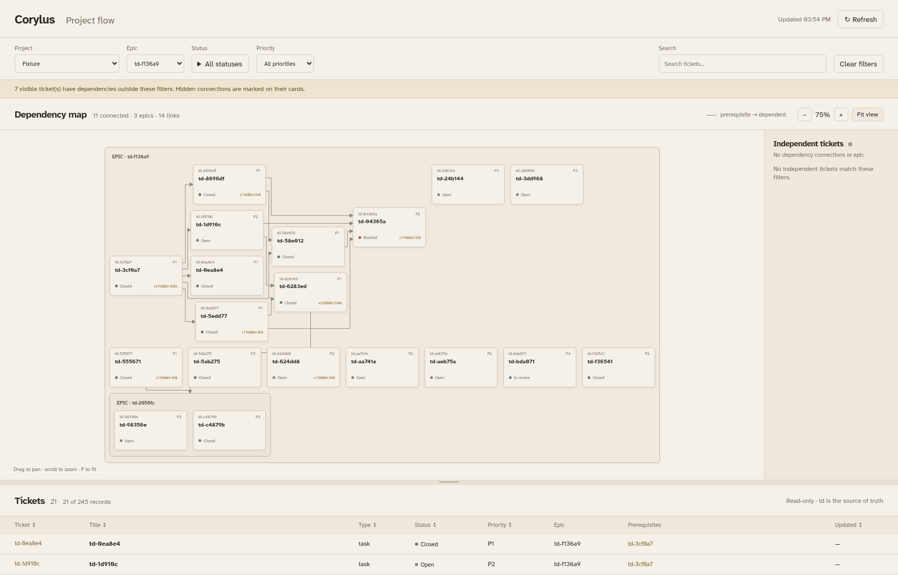
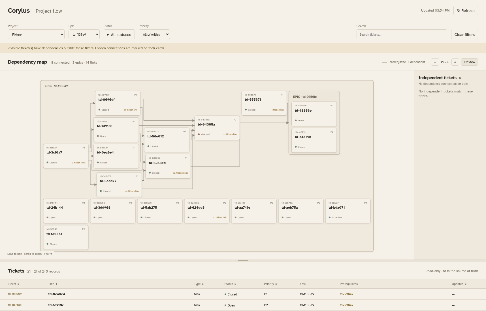

# Left-to-right epic dependencies

Written by an AI agent (Codex).

Chromium comparison against `cda18d5`, using the existing scheduled homelab
snapshot on 2026-10-07. No export command, deployment, or tracker snapshot
modification. Ticket text is anonymized; screenshots retain real topology,
ticket IDs, priorities, and statuses. The snapshot hash is in the metrics file.

The baseline already uses ELK `RIGHT` for connected local chains. Its wrapping
places two dependencies between local components and nested epic boxes
vertically or backward. Keep these linked groups horizontal inside each epic;
unrelated groups and dependency-ordered root epic rows still wrap. Tighten gaps
to 8px and give nested boxes the remaining horizontal space to retain compact
bounds. Cards and epic labels retain their dimensions.

| Evidence | Before | After |
| --- | ---: | ---: |
| Tickets / dependency paths | 245 / 116 | 245 / 116 |
| Cards / epic boxes / sidebar cards | 184 / 21 / 39 | 184 / 21 / 39 |
| Immediate-epic edges right / left / vertical | 60 / 1 / 1 | 62 / 0 / 0 |
| Shared rendered epic ancestor edges right / left / vertical | 62 / 3 / 1 | 66 / 0 / 0 |
| Rendered bounds | 1408 × 6392 | 1584 × 5852 |
| Rendered area | 8,999,936 | 9,269,568 (+3.00%) |

The unchanged compactness gate allows at most 5% area growth. All 74 JavaScript
tests, the Python suite (72 tests, one scheduled-export restriction skip), Ruff,
ESLint, and both Chromium suites pass. New direction tests fail twice against
the baseline and pass with the fix; nested containment, sidebar membership,
top anchors, wrapping, selection, filters, and complete Fit remain covered.
A bounded ELK-call test covers deep nested epics; placement caching and a strict
width-reduction guard prevent repeated work at unchanged widths.

Round 1 review reproduced an acyclic diamond: epic E contains a, b, and nested
epic N(n), with edges a → b, a → n, and n → b. Contracting a and b into one
local block introduced a cycle in the block ordering and placed n after b.
Only local components in a projected cycle through a nested box now split
into topological slices; unaffected components retain their compact ELK layout.
ELK and Chromium regressions at widths 1400 and 450 require a.x < n.x < b.x,
all three routes, and nested containment. Before: a.x=24, n.x=420, b.x=216;
after: a.x=24, n.x=228, b.x=432. Diamond bounds remain 640 × 228.

The snapshot gate includes dependencies across nested boxes with a shared
rendered epic ancestor. Flattened umbrella page frames retain their intentional
root-row wrapping. The refreshed round 3 snapshot comparison passes that gate
and preserves all node/path counts within the unchanged area gate.

Round 2 review found that an unrelated six-card no-epic chain displaced two
epics from y=16 to y=124 and widened their wrapping budget at width 450. Root
packing now retains boxes-first priority and uses the viewport width even when
an unrelated DAG overflows. Dependencies still determine prerequisite order.
ELK and Chromium fixtures require the first epic at y=16, both epics in the
desktop top row, the second epic on a new narrow row, and all chain routes.

The page-level diamond a → b, a → N(n), n → b also needs component refinement.
Before, n.x=408 exceeded b.x=204. Root refinement now places a.x=12, n.x=216,
b.x=420 at width 1400. At width 450, root blocks wrap in prerequisite order
a, N(n), b. Three routes and containment remain verified in both renderers.

The browser diamond check now waits for nonzero geometry and all routes, then
captures related bounds in one browser turn. Three repeated full layout-fixture
runs verify the former transient zero-size boundary failure.

Required viewer Ruff/ESLint checks pass. An additional repository-wide Ruff
check reports 28 existing findings in five unchanged legacy files and none in
the changed files; those are outside this ticket's scope.




[Full before](round3/homelab-before.png), [full after](round3/homelab-after.png),
[initial framing after](round3/homelab-after-initial.png),
[machine-readable metrics](round3/homelab-layout-metrics.json),
[desktop nested diamond](round3/horizontal-diamond-1400.png),
[narrow nested diamond](round3/horizontal-diamond-450.png),
[desktop page diamond](round3/page-diamond-1400.png),
[narrow page diamond](round3/page-diamond-450.png),
[desktop mixed root](round3/mixed-root-1400.png),
[narrow mixed root](round3/mixed-root-450.png).

Root epic rows retain dependency order and wrap to the viewport. Cross-epic
arrows can span rows; cyclic relationships cannot all point right. Orthogonal
routes retain the existing limitation of no intervening-box obstacle avoidance.
This is local source evidence; independent review and orchestrator deployment
remain separate.

Reproduce without exporting:

```sh
uv run --no-project --with playwright==1.55.0 --with httpx python tests/check_flow_layout.py \
  --snapshot /srv/projects/homelab/.todos/export.json \
  --baseline-ref cda18d5 --focus-epic td-f136a9 \
  --screenshots /tmp/td-1e9ebe-evidence
```
