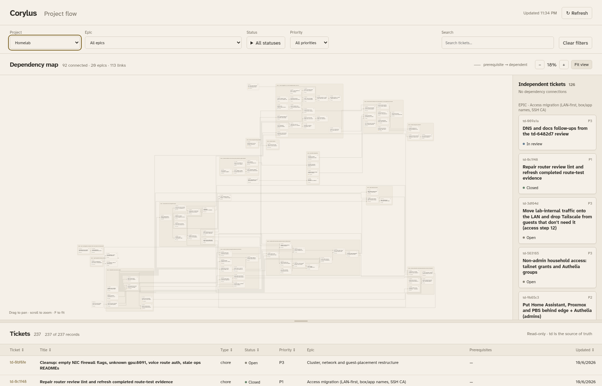
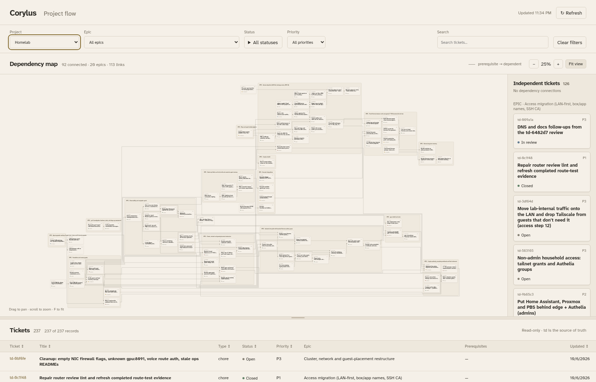
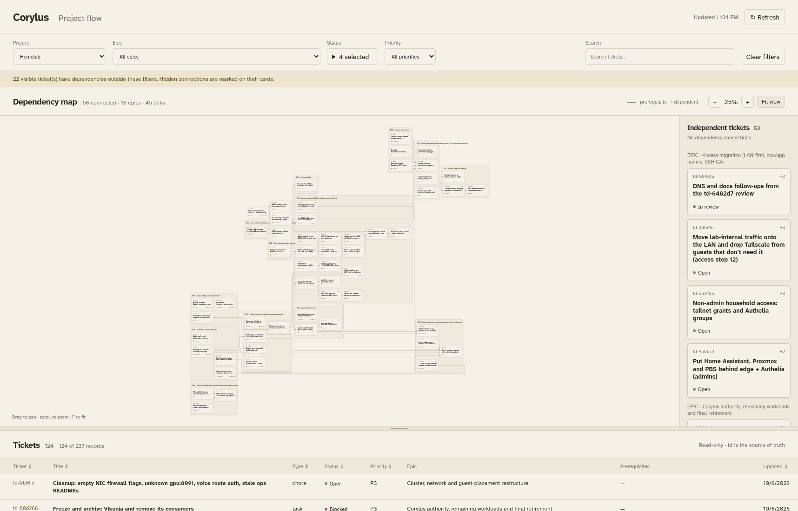

# Compact graph evidence: td-8a2b90

Measured against one live Homelab snapshot obtained from the loopback viewer:

```bash
python3 td_flow.py --project Homelab=/srv/projects/homelab --port 8796
mkdir -p test-results/compact-graph
curl -fsS 'http://127.0.0.1:8796/api/flow?project=homelab' \
  -o test-results/compact-graph/homelab.json
```

The snapshot contains 237 ticket records, 20 epic records and 113 dependencies.
92 connected cards and 15 populated epic boxes appear on the canvas. The
screenshot supplied with the ticket predates this export (227 tickets, 19
epics, 104 edges). Both measurements below use the same newer snapshot, with
all statuses selected. Its SHA-256 is
`49cb346c1d62267931834a00d8f6532f40abb211a0466cb9bd668769da271dd8`.
The raw tracker export stays in ignored local test results.

| Metric | Baseline (`643980a`) | Compact layout | Reduction |
| --- | ---: | ---: | ---: |
| Canvas width | 5,618 | 4,829 | 14.0% |
| Canvas height | 3,590.758 | 2,657 | 26.0% |
| Canvas area | 20,172,876 | 12,830,653 | 36.4% |
| Total routed edge length | 124,423 | 100,774 | 19.0% |
| Cards / populated epic boxes / edges | 92 / 15 / 113 | 92 / 15 / 113 | Preserved |
| Overlapping cards or sibling epic boxes | 0 | 0 | — |
| Fit zoom at the screenshot viewport | 18% | 25% | Larger cards |

Area is ELK root width × height, including its padding. Edge length is the sum
of Euclidean lengths of all segments in every routed section; it counts each
dependency separately, including any shared segment. Chromium's rendered SVG
path lengths agree with the ELK totals within one unit. Measurements use
independent layout inputs because ELK may mutate input edge objects.

Investigation compared spacing, balanced placement, network-simplex placement,
orthogonal/polyline routing, horizontal/vertical direction, post-compaction,
hierarchical sweep and component options. Applying settings only at the root
left unnecessary space inside epics. The selected change applies the same
network-simplex placement, edge-length compaction and spacing to both levels.
It preserves card sizes, epic membership and the existing interface.

Excluding only `closed` yields 56 connected cards and 45 visible edges, bounds
2,588 × 2,499, area 6,467,412 and total edge length 23,110. This is a further
49.6% area reduction from the compact all-status view. Filters already rebuilt
the layout before this change; the new browser assertions protect that behavior.

Screenshots use headless Chromium at 1716 × 1100, the same snapshot, and the
graph pane enlarged to 80% using its existing keyboard control. The baseline
loads the model from `643980a`; the after view loads this branch's model.
The pictures retain the same filters and fit behavior. Source data was served
by the requested viewer on `127.0.0.1:8796`; capture replayed that fixed response
to prevent tracker changes from affecting the comparison.

Before:



After:



After excluding closed tickets:



Validation: all 54 Node tests and 71 Python tests pass, along with ESLint, Ruff,
first-party diff checks and the Chromium browser suite. Four new tests run the
vendored ELK engine and check compactness, filter bounds, disconnected component
packing and cycles. They check sibling overlap, containment, exact node/edge
identity, and routed source/target endpoints on the correct card boundaries.
The synthetic compound fixture reduces area by 22.0% and edge length by 6.6%.
Browser assertions additionally check that search and status filters reduce
rendered bounds; existing keyboard, selection, refresh and responsive checks pass.
