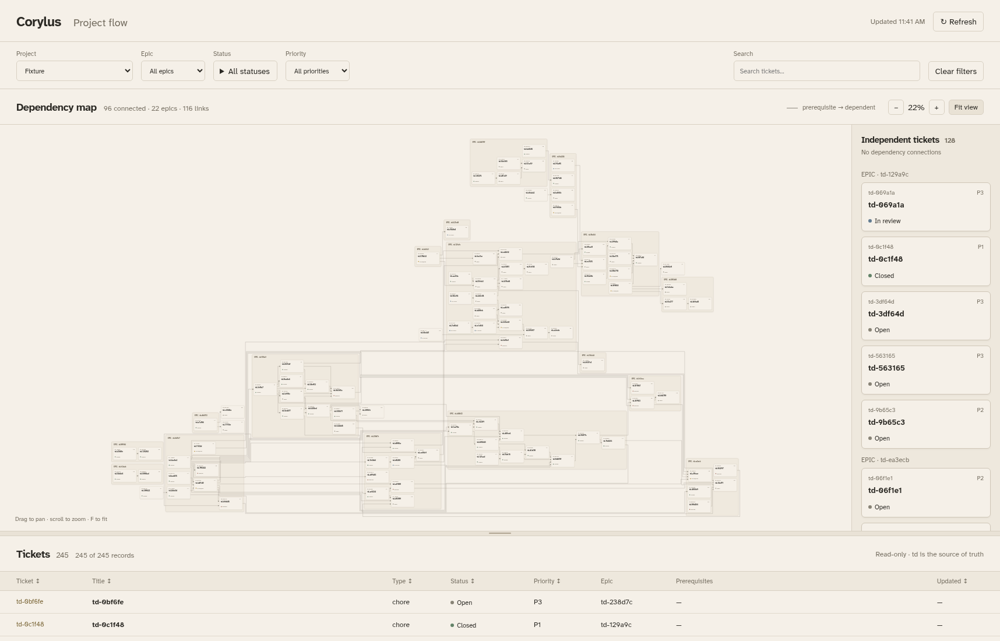
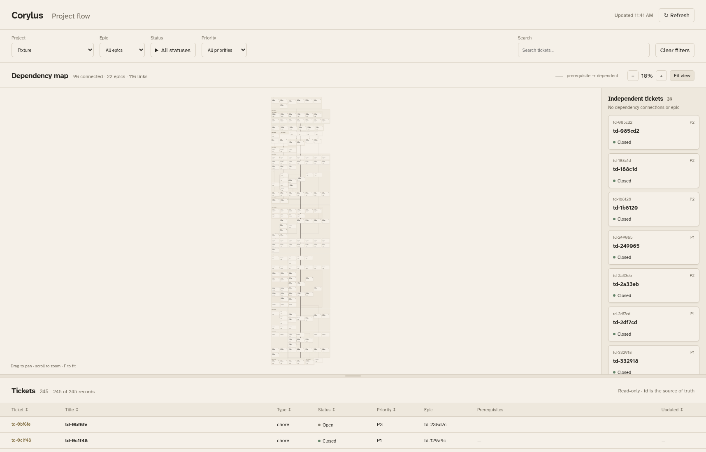
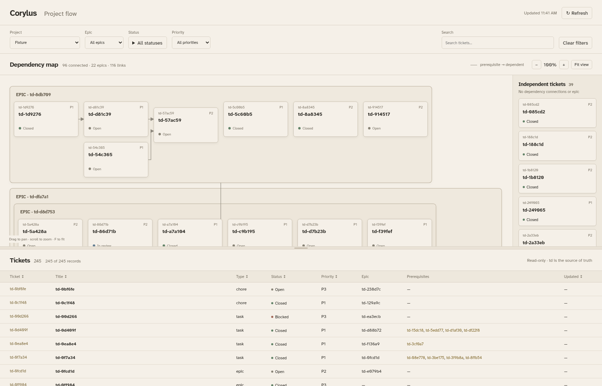

# Epic hierarchy and anchored rows: td-dd75d8

Written by an AI agent (Codex).

Chromium compares the deployed source revision `c14112c` with this change,
using the same existing scheduled Homelab snapshot. The snapshot contains
245 ticket records and 116 dependency links. It was read without invoking
`td export`; no tracker snapshot or ticket details are checked in.

Screenshots anonymize all titles, descriptions, acceptance criteria, labels,
and timestamps. Ticket IDs, parent relationships, dependencies, status,
priority, and fixed card dimensions are preserved. Both images use the same
1716 × 1100 viewport, all statuses, and the graph pane at 80% height.

| Measurement | Before (`c14112c`) | After |
| --- | ---: | ---: |
| Rendered graph width | 4,966 | 1,408 |
| Rendered graph height | 2,985 | 6,392 |
| Rendered graph area | 14,823,510 | 8,999,936 |
| Graph cards | 96 | 184 |
| Epic boxes | 17 | 21 |
| Dependency paths | 116 | 116 |
| Independent shelf tickets | 128 | 39 |
| Page ready, seconds | 2.428 | 1.984 |
| Initial graph zoom | 14.8% | 99.6% |

Rendered graph area decreases **39.29%**, while moving 89 epic-owned tickets
off the independent shelf. Epic tickets are represented by their containing
boxes; the root umbrella epic is the page frame. All 116 dependency paths
remain visible. Width and height are Chromium's unscaled SVG bounding box,
including the rendered dependency paths. Timings measure page navigation
through the first rendered graph; they are single local runs, not a benchmark
distribution. The precise snapshot hash and metrics are in [metrics.json](metrics.json).

Wrapping gives the all-status graph a tall shape. Initial, filter, and viewport
resize framing fits its width and anchors its top, preserving readable cards.
Explicit Fit in view retains the complete overview, including every wrapped
row; reading individual cards from that overview requires zooming and
panning. Cross-epic connectors preserve every dependency but do not avoid
obstacles, so connectors may pass through cards or boxes, especially for
cycles and wrapped rows. The screenshots show these behaviors without
cropping or altering the graph.

Before:



After:



After initial load, with readable cards and top anchoring:



Reproduce the comparison from an existing scheduled snapshot:

```bash
.venv/bin/python tests/check_flow_layout.py \
  --snapshot /srv/projects/homelab/.todos/export.json \
  --baseline-ref c14112c
```

The same Chromium check verifies nested membership and containment, nested and
root sibling top alignment, viewport wrapping and widening again, selectable
epic labels with preserved Enter/Space focus, table membership, strict shelf
eligibility, cross-epic links, and an umbrella epic as the page frame even when
a search shows just one of its child epics.
The existing complete browser check reads isolated TD fixtures through
`td list`, `td show`, and `td dep`; it does not invoke TD's export writer.
