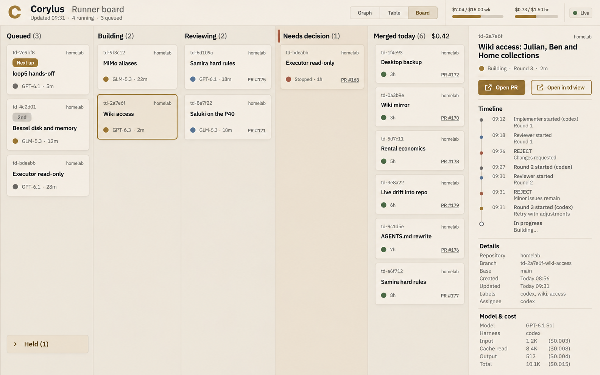
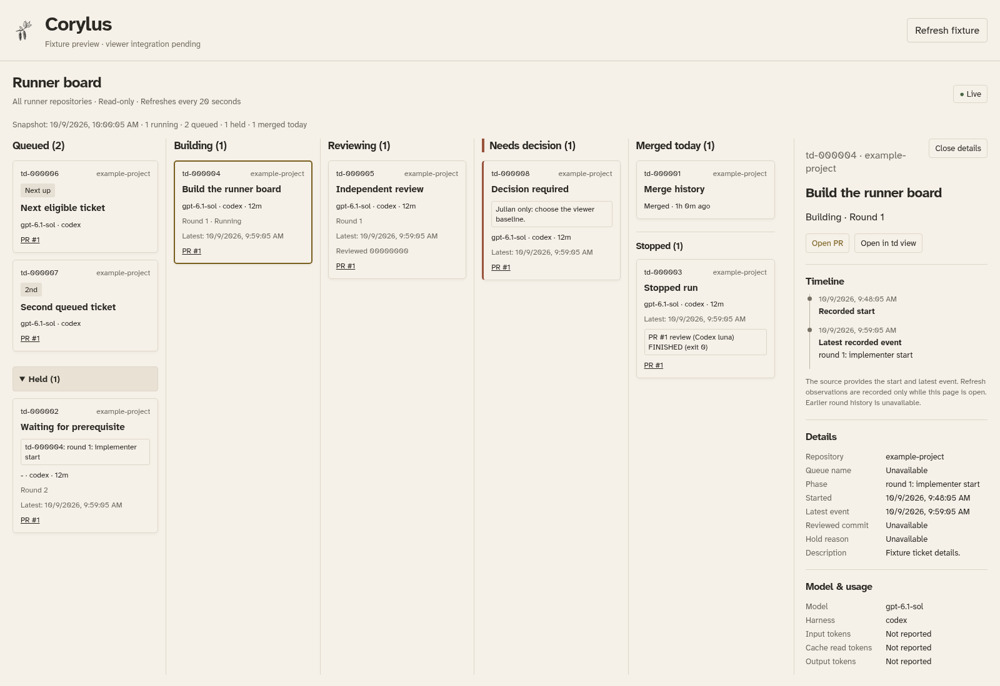

# Runner Board component

Written by an AI agent (Codex (GPT-6.1 Sol)). Ticket td-664dd4.

This branch contains a read-only Board component and a bounded reader for
runner state schema version 1. **Viewer integration is pending.** The assigned
`main` base does not contain `td_flow.py`, `static/flow.html`, `flow.css`,
`flow.js`, or the viewer's package and lint configuration. Those are on the
previously reviewed `feat/td-project-flow` branch. The component preview below
is test scaffolding; it does not replace the existing application.





## Local configuration and data

Set `CORYLUS_RUNNER_STATE_FILE` in the viewer's local process environment.
Its value is the local state file selected by the operator. Do not commit that
value or a runtime snapshot. `snapshot_from_environment()` reads the file
without changing it and returns an allowlisted public projection. It rejects
unsupported versions, malformed records, nonregular files, and oversized data.
The browser receives repository labels, never source, worktree, or digest paths.
GitHub PR links must use HTTPS without credentials or query strings.

The renderer expects `/api/runner` to return that projection. It polls every
20 seconds and retains the last successful snapshot with a stale indicator
after a failure. Source snapshots over one minute old also appear stale.
“Merged today” counts dated merge events using the viewer's calendar day.
Legacy time-only records cannot establish a day or elapsed duration.
Merge cards preserve historical merge identity and do not borrow a rerun's PR
or model details.

Schema v1 does not provide ticket titles, full event history, tokens, or cost.
Titles and details must come from the existing configured td project view.
The drawer shows recorded start/latest events and separately labeled transitions
observed while the page is open. Missing accounting says “Not reported.” Codex
never displays a dollar amount. Optional gateway spend meters remain a follow-up.

## Decisions required before integration is complete

1. Make the reviewed viewer baseline available on `main`, or explicitly authorize
   including its source in this PR. The assignment prohibits merging, and this
   branch has not merged or copied that baseline.
2. Supply explicit queue ranks in the producer. The inspected producer iterates
   tickets in sorted ID order. That order cannot identify dispatch priority.
   An optional positive-integer `queue_position` extension is supported, but
   absent ranks stay unknown and produce no “Next up” or “2nd” badges. This
   extension is exercised with synthetic fixture data; existing v1 output does
   not emit it. An upstream producer change is outside this assignment.

## Integration contract

After resolving the baseline, add the read-only `/api/runner` route after the
existing Host/Origin/query validation and route it to
`runner_state.snapshot_from_environment()`. Keep all write methods rejected.
Add the Board scripts and stylesheet to the server's static allowlist.

Load `runner_board_model.js` before `runner_board.js` and initialize it after
`#runner-board-pane` exists. The page should retain its existing graph/table
layout under Graph, offer a full Table view, and add Board in the same toggle.
Use the real logo asset. The API is:

```js
RunnerBoard.initialize({
  lookupTicket(repo, id) { /* Return the matching configured td ticket. */ },
  openTicket(repo, id) { /* Select that project and ticket in the existing view. */ }
});
RunnerBoard.updateTickets(repoLabel, projectSnapshot);
RunnerBoard.setVisible(true);
RunnerBoard.refresh();
RunnerBoard.stop();
```

Configured project identity must be matched to runner repository identity;
ticket IDs alone are insufficient across projects. The Board contains all runner
repositories, so the graph's project/epic/status filters should be hidden in
Board mode rather than silently filtering its counts. Missing configured ticket
data remains explicit and cannot produce a working ticket-view action.

## Component verification

The sanitized fixture preserves five real source records' shape, columns,
models, and timestamp formats. IDs, review heads, repository labels, PR numbers,
and prerequisite references are anonymized; source paths and URLs are removed.
The browser harness adds clearly synthetic queued/decision records, explicit
queue ranks, current dated timestamps, and matching fixture titles.

```sh
PYTHONPATH=. python3 -m unittest discover -s tests -p test_runner_state.py
node --test tests/test_*.js
python3 -m ruff check runner_state.py tests/test_runner_state.py tests/check_runner_board_browser.py
eslint --config eslint.runner.config.js static/runner_board*.js tests/test_runner_board.js
python3 tests/check_runner_board_browser.py --chromium chromium
git diff --check
```

The harness requires Playwright and Chromium. It checks columns, held expansion,
the drawer, ticket callback, Codex accounting, live transitions, failed-refresh
recovery, literal text, and a small viewport. It contacts no external service and
runs no tracker commands. These checks validate the components; acceptance of
the integrated Graph/Table/Board product remains outstanding.
